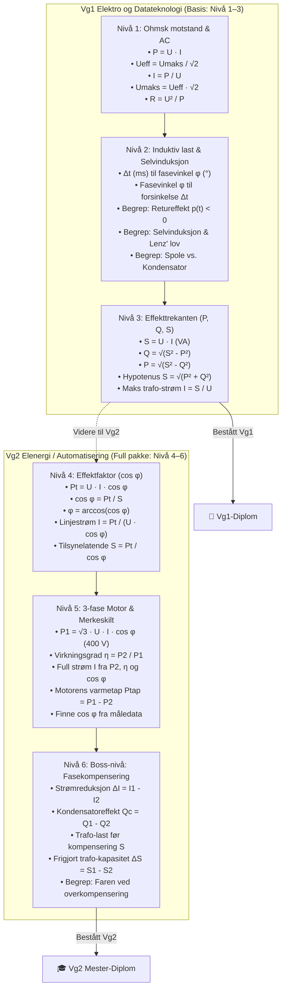

# Teknisk Rammeverk og Pedagogisk Spesifikasjon for Gamify-Læringsopplegg

> **Formål med dette dokumentet:**  
> Dette dokumentet er den offisielle tekniske og pedagogiske arkitekturspesifikasjonen for pedagogiske applikasjoner i **Gamify-serien**. Dokumentet er utformet slik at en AI-assistent (eller en utvikler) kan ta det som utgangspunkt for å forske på, designe og programmere nye interaktive læringsopplegg innen vilkårlige fagområder (f.eks. medikamentregning, elektrofag, automasjon, kjemiske likevekter, fysikk, mekanikk, digitalteknikk, matematikk m.fl.) med nøyaktig samme høye kvalitet, pedagogiske dybde, spillmekanikk og lærerkontroll.
>
> Som referanseimplementasjon og gullstandard brukes **EffektMesteren** (`effektMester.html`).

---

## 1. Hovedfilosofi og Teknisk Arkitektur

### 1.1 Alt-i-én-fil (Single-File Architecture)
Hvert spill skal være en **100 % selvstendig HTML5-fil** (`.html`).
- **Ingen eksterne rammeverk eller byggesteg:** Ingen React, Vue, Webpack, Node.js eller eksterne CDN-er er påkrevd for kjernefunksjonaliteten.
- **Ingen eksterne biblioteker for visualisering:** All simulering, vektorgrafikk og grafer kodes direkte med **HTML5 Canvas 2D API** eller inline **SVG**.
- **Ingen eksterne lydfiler:** All lydeffekt lages syntetisk i sanntid via **Web Audio API** (`AudioContext`).
- **Portabilitet:** Filen kan dobbeltklikkes og kjøres lokalt i nettleseren (`file:///`), lastes opp i læringsplattformer (Canvas, Teams, It's Learning, Moodle) eller hostes statisk på GitHub Pages / netttjener uten database eller backend.

### 1.2 Responsivt Brukergrensesnitt (To-kolonners Læringsmodell)
Skjermbildet er delt i en balansert to-kolonners layout (`desktop: grid 1fr 1fr`, `mobil: 1 kolonne`):
1. **Venstre kolonne: Lærings- og Eksperimenteringssone (Teori & Simulator)**
   - Teorigjennomgang tilpasset nivået.
   - Formelboks med syntaksutheving.
   - Interaktive fagord-tooltips på hover/berøring.
   - Pedagogiske tipsbokser (gule advarsler, røde fallgruver, grønne gevinster).
   - Eksterne fordypningsressurser (fagartikler fra f.eks. NDLA, utvalgte YouTube-videoer med tidsstempler).
   - **Interaktiv HTML5 Canvas-simulator:** Sanntids visualisering med slidere, måleinstrumenter og grafer der eleven kan eksperimentere med parametere før de regner.
2. **Høyre kolonne: Spillutfordring & Mestringsarena («5 på rad»)**
   - Nivåvelger-brikker med stjerner og statusmerker.
   - Oppgavekort med type-badge, spørsmålstekst og enheter.
   - Svarseksjon: Numerisk felt med virtuell keypad eller flervalgsalternativer.
   - Hint-funksjon med pedagogisk konsekvens.
   - Tilbakemeldingsboks (grønn suksess / rød feil).
   - Detaljert, trinn-for-trinn matematisk/faglig forklaring ved feil svar.

---

## 2. Pedagogisk Pedagogikk og Spillmekanikk

### 2.1 «Mastery Learning» og 5 på rad (`targetStreak = 5`)
- Eleven må klare **5 oppgaver på rad uten feil** for å bevise full måloppnåelse og låse opp neste nivå (eller oppnå stjerne på nivået).
- **Konsekvens av feil:** Feil svar nullstiller den aktive øvingsrekken til 0 (dersom nivået ikke allerede er bestått tidligere). Dette tvinger frem konsentrasjon og forhindrer ren gjetting.
- **Pedagogisk hint-mekanisme:**
  - Eleven kan trykke `💡 Vis hint` for å få formelhjelp eller tenketips.
  - Svarer eleven riktig med hint aktivt, **beholdes rekken** (den nullstilles ikke), men eleven får **ingen ny stjerne**. Dette gir mestringsfølelse uten at man kan «jukse» seg til seier med hint på alle oppgaver.

### 2.2 Rundebunke-mekanismen (Card Deck Shuffle)
For å unngå at en elev får samme oppgavetype 5 ganger på rad eller slipper unna de vanskeligste formlene:
- **Nøyaktig 5 unike oppgavetyper per nivå:** Hvert nivå representerer 5 distinkte faglige vinkler/formelvariasjoner (f.eks. direkte formel, omforming for strøm, omforming for motstand, begrepsforståelse/flervalg, praktisk case).
- **Kortstokk-prinsippet:** Oppgavetypene legges i en bunke `[1, 2, 3, 4, 5]` og stokkes tilfeldig (Fisher-Yates shuffle).
- **Garantert full dekning:** I løpet av en sammenhengende 5-streak-runde (0 til 5 stjerner) er eleven **garantert å møte hver eneste av de 5 oppgavetypene nøyaktig én gang**.
- **Stokk-reset:** Hvis eleven svarer feil eller bytter nivå, tømmes bunken slik at neste øvingsrunde starter med en nystokket, full bunke.

```javascript
// Eksempel fra EffektMesteren:
function getNextQuestionType(level) {
    if (!GameState.levelQuestionDecks[level] || GameState.levelQuestionDecks[level].length === 0) {
        const pool = [1, 2, 3, 4, 5];
        for (let i = pool.length - 1; i > 0; i--) {
            const j = Math.floor(Math.random() * (i + 1));
            [pool[i], pool[j]] = [pool[j], pool[i]];
        }
        // Unngå umiddelbar repetisjon av forrige type ved omstokking
        if (GameState.lastTypeByLevel[level] === pool[pool.length - 1] && pool.length > 1) {
            const swapIdx = Math.floor(Math.random() * (pool.length - 1));
            [pool[pool.length - 1], pool[swapIdx]] = [pool[swapIdx], pool[pool.length - 1]];
        }
        GameState.levelQuestionDecks[level] = pool;
    }
    const chosenType = GameState.levelQuestionDecks[level].pop();
    GameState.lastTypeByLevel[level] = chosenType;
    return chosenType;
}
```

### 2.3 Dynamisk Oppgavegenerering med Realistiske Tall
- Alle oppgaver genererer realistiske, yrkesrelevante tallverdier (ikke urealistiske tall som 10 000 A i en panelovn).
- Avrunding og signifikante sifre matches mot bransjestandard.
- **Toleranse (`tolerance`):** Numeriske svar aksepterer en realistisk toleranse (f.eks. $\pm 0,1\text{ A}$ eller $\pm 2\%$) slik at elever ikke straffes for legitime avrundingsforskjeller underveis på kalkulatoren.
- **Duplikatsjekk (`signature`):** Hver oppgave har en unik signaturstreng (f.eks. `L1_T1_230_8.5`). Generatoren sikrer at samme oppgave aldri gis to ganger på rad.
- **Flervalgsrotasjon:** Alle flervalgsspørsmål stokker svaralternativene tilfeldig (`shuffleArray(choices)`) slik at riktig svar aldri har en fast posisjon (f.eks. alternativ A).

---

## 3. Interaktive Fagord-Tooltips (Glossary System)

### 3.1 Hensikt
Tekniske fagord som elevene kanskje ikke har lært ennå, eller som kan virke overveldende, skal aldri være en barriere for å forstå oppgavene.

### 3.2 Implementering
- En sentral JavaScript-ordbok (`ELECTRICAL_GLOSSARY` / `SUBJECT_GLOSSARY`) definerer begreper med tittel og lettfattelig, elevvennlig definisjon på norsk.
- **Stiplet understreking:** Fagord merkes i CSS med `border-bottom: 1.5px dotted var(--primary)` og et lite opphøyet `ⓘ`-ikon.
- **Hover & Touch:**
  - På datamaskin fader en mørk, kontrastrik infoboks (`.tooltip-card`) opp når musen føres over ordet.
  - På berøringsskjermer (iPad/mobil) kan eleven trykke på ordet for å åpne, og trykke utenfor for å lukke.
- **Automatisk tekstberiking (`enrichTextWithTooltips`):**
  - Fagordene i teoritekster, oppgavetekster, hint og fasitforklaringer berikes automatisk, slik at eleven kan få hjelp til begrepet uansett hvor det opptrer på skjermen.
- **Kantsikring:** Systemet kalkulerer automatisk avstand til skjermkanten slik at boksen aldri klippes av vindusrammen.

---

## 4. Sikkerhet, Lagring og Hemmelig Juksedeteksjon

### 4.1 Lagre og Fortsette Senere («Lagre / Hent»)
Elever må kunne lagre fremgangen sin for å fortsette hjemme eller neste skoledag:
1. **Navnelås:** Eleven må oppgi fullt navn for å generere en lagringskode. Navnet låses permanent i økten.
2. **Kryptografisk Hash:** Koden genereres ved en kombinasjon av to uavhengige hash-funksjoner (FNV-1a og djb2), elevens normaliserte navn, oppnådd nivå, spillmodus og en hemmelig salt-streng:
   $$\text{Hash} = f(\text{navn}, \text{nivå}, \text{modus}, \text{cheatUsed}, \text{salt})$$
3. **Avvisning av andres koder:** Hvis Elev B taster inn lagringskoden til Elev A sammen med sitt eget navn, avvises den tvert som ugyldig.
4. **Låst diplom:** Når et spill fullføres etter lasting av en kode, er navnefeltet på diplomet låst til lagret navn. Ingen kan ta en annens kode for å skrive ut diplom i eget navn.
5. **Delt PC / Logg ut:** `🚪 Logg ut`-knapp lar elever nullstille økten så neste elev ved samme PC kan starte med blanke ark.

### 4.2 Hemmelig Lærermeny (Lærerverktøy)
- Åpnes med hurtigtast `Ctrl + Alt + K` eller `Ctrl + Shift + K`, alternativt ved 7 raske klikk på logoen/headeren.
- Inneholder:
  - Fasit og trinnvis løsning på aktiv oppgave.
  - Hurtigknapper for å hoppe mellom nivåer (1–6).
  - «Fyll inn fasit»-knapp (`cheatFillAnswer()`).
  - «+1 Streak» og «Fullfør nivå nå».
  - Direkte forhåndsvisning av diplomer.

### 4.3 Juksedeteksjonens Livssyklus (Øving vs. Test)
> [!IMPORTANT]
> **Skille mellom lovlig forberedelse og juks på testen:**
> - **Før testen starter (Nivå 1, streak 0):** En elev har lov til å åpne lærermenyen for å se formler, fasiter og forberede seg. Dette merkes **IKKE** som juks (`cheatUsed = false`).
> - **Klargjøring til test:** Eleven klikker på «Nivå 1» i lærermenyen og **lukker lærermenyen**. Eleven har nå en **100 % ren start**.
> - **Under testen (hva som trigger juks):**
>   1. Åpne lærermenyen mens eleven er på et høyere nivå ($> 1$) eller har samlet stjerner ($\text{streak} > 0$).
>   2. Svare på en oppgave mens lærermenyen står åpen på skjermen.
>   3. Bruke jukseknapper («Fyll inn svar», «+1 Streak», nivåhopp).
>   4. Laste inn en lagringskode som inneholder juks.

### 4.4 Lærerens Tredelte Spor på Diplomet
Dersom en elev har jukset, vil diplomet fortsatt vises og se tilsynelatende normalt ut for eleven, men inneholder **tre hemmelige markører** som kun læreren kjenner til:

| Nr | Markør | Ekte / Ærlig gjennomført | Jukset / Brukt lærermeny |
| :--- | :--- | :--- | :--- |
| **1** | **Bakgrunnsvannmerke** | *(Helt rent diplom uten vannmerke)* | Svakt amber/gull stempel: `★ MODUS-K ★` rotert 24° i bakgrunnen. Bevares ved utskrift og PDF. |
| **2** | **Sikkerhets-ID / Serienummer** | Prefix `-V` (**V**erifisert)<br>F.eks. `EM-2026-VG2-V4A89` | Prefix `-K` (**K**ontroll / Juks)<br>F.eks. `EM-2026-VG2-K4A89` |
| **3** | **Typografiske mikromarkører** | Ordinær underskrift og dato:<br>`Ingve Bjørnå`<br>`19. september 2026` | Liten stjerne og midtstilt prikk:<br>`Ingve Bjørnå*`<br>`19. september 2026 ·` |

### 4.5 Utskriftssikring (`@media print`)
- CSS tvinger nettleseren til å skrive ut bakgrunnsgrafikk og farger:  
  `-webkit-print-color-adjust: exact !important; print-color-adjust: exact !important;`
- JavaScript lytter på `window.addEventListener('beforeprint', ...)` og sørger for at navnet på diplomet matcher det låste navnet, og at vannmerket og sikkerhets-ID oppdateres før papir/PDF genereres.

---

## 5. Audiovisuell Feedback og Belønning

1. **Syntetisk Web Audio API (`SoundFX`):**
   - **Riktig svar:** Lys, oppadgående arpeggio (3 toner: 523 Hz, 659 Hz, 784 Hz - C-E-G).
   - **Riktig svar med hint:** Dempet, behagelig to-toners klang.
   - **Feil svar:** Dyp, myk tone (140 Hz sagtanntone med eksponentielt fall).
   - **Nivå fullført / Seier:** Triumferende fanfare (C5, G4, C5, E5, G5).
   - **Lydkontroll:** Egen knapp i header (`🔊 Lyd: På` / `🔇 Lyd: Av`) som husker elevens valg.
2. **Fyrverkeri-animasjon:**
   - Fullskjerms HTML5 Canvas-animasjon med partikkelfysikk (tyngdekraft, hastighetsvektorer, fargerike eksplosjoner og fading) som avspilles i 3,5 sekunder når hele pensumet er bestått.
3. **Offisielt Personlig Diplom:**
   - Henter dato automatisk på norsk format («19. september 2026»).
   - Viser elevens navn, tittel på sertifisering, liste over faglige kompetansemål fra læreplanen, og formell underskrift.

---

## 6. Eksempeloppbygging: Nivåstrukturen i EffektMesteren

Her er standardmodellen for hvordan 6 nivåer fordeles på to utdanningsår (eller grunnleggende vs. avansert pensum):



---

## 7. Trinnvis Oppskrift for å Lage et Nytt Læringsopplegg

Når du skal instruere en AI om å bygge et nytt læringsopplegg basert på denne malen, følg denne standardstrukturen:

### Trinn 1: Faglig Analyse og Målgruppe
1. Definer **fagområde**, **læreplanmål** og **målgruppe** (f.eks. *«Medikamentregning for helsefagarbeidere og sykepleiere»* eller *«Newtons lover og bevegelse for Fysikk 1»*).
2. Definer **nivåinndeling** (vanligvis 5 til 8 nivåer med økende vanskelighetsgrad).
3. Bestem om det skal være en todeling (f.eks. Grunnleggende Nivå 1–3 med del-diplom, og Videregående Nivå 4–6 med master-diplom).

### Trinn 2: Definere 5 Oppgavetyper per Nivå (Rundebunken)
For *hvert* nivå må du spesifisere nøyaktig 5 oppgavetyper:
- **Type 1:** Direkte grunnformel (f.eks. regne ut Dose gitt Styrke og Mengde).
- **Type 2:** Omformet formel A (regne ut Mengde gitt Dose og Styrke).
- **Type 3:** Omformet formel B eller enhetskonvertering (f.eks. gram til milligram før innsetting).
- **Type 4:** Sammensatt praktisk yrkessituasjon (f.eks. infusjonshastighet over tid, eller to parallelle laster).
- **Type 5:** Begrepsforståelse / Flervalgsspørsmål (hvorfor skjer et fenomen, faremomenter, enhetsforståelse).

### Trinn 3: Designe den Interaktive Simulatoren (HTML5 Canvas)
Hvert nivå skal ha en visuell sandkasse der eleven kan manipulere 1–3 slidere:
- Hva skal tegnes på Canvas? (Bølger, kretser, sprøyter, vektorpiler, grafer, grafer over tid).
- Hvilke sanntidsverdier skal vises i resultat-pillene (`.res-pill`) under lerretet?

### Trinn 4: Skrive Ordbok over Fagbegreper (`SUBJECT_GLOSSARY`)
Identifiser 12–20 fagord som kan være vanskelige for elevene. Skriv 2–3 setninger på lettfattelig norsk for hvert ord, og la systemet automatisk legge på `.term-hint` i både teori og oppgavetekster.

### Trinn 5: Formelbokser og Teorikort
For hvert nivå:
- 2–3 avsnitt konsis teori.
- 1 formelboks med alle formler og omforminger som trengs for å løse nivåets 5 oppgaver.
- Tipsboks med analogier eller kalkulatortips (f.eks. «Ølglass-analogien» for $P, Q, S$).
- 1–2 lenker til gode eksterne ressurser (f.eks. NDLA eller YouTube).

### Trinn 6: Integrere Sikkerhets- og Lagringssystemet
- Gi spillet en unik prefiks (f.eks. `MR` for MedikamentRegning, `KM` for KretsMester, `EM` for EffektMester).
- Bruk standard implementering for `generateGameHash`, `validateGameCode`, `toggleCheatMenu`, `cheatFillAnswer` og vannmerke-systemet (`★ MODUS-K ★`).

---

## 8. Sjekkliste for Kvalitetssikring

Før et nytt læringsopplegg godkjennes, skal det verifiseres mot følgende sjekkliste:

- [ ] **Selvstendig teori:** Inneholder teoripanelet på det aktuelle nivået alle formler og forklaringer som trengs for å løse samtlige 5 oppgavetyper på nivået?
- [ ] **Rundebunke uten duplikater:** Sikrer `getNextQuestionType(level)` at alle 5 oppgavetyper trekkes i løpet av en 5-streak runde?
- [ ] **Flervalgsrotasjon:** Er alle flervalg utstyrt med `shuffleArray(choices)` slik at fasit aldri har fast plassering?
- [ ] **Toleranser:** Har alle numeriske svar en hensiktsmessig `tolerance` så ikke avrundinger på kalkulatoren gir urettmessig feilsvar?
- [ ] **Virtuelt tastatur:** Fungerer keypaden på iPad/mobil uten fysisk tastatur?
- [ ] **Infobokser:** Fader infobokser opp på hover og berøring, og justerer de seg bort fra skjermkanten ved behov?
- [ ] **Anti-juks:**
  - Er lærermenyen tilgjengelig med `Ctrl + Alt + K` og 7 klikk på logo?
  - Er åpning på Nivå 1 (streak 0) lovlig og upåvirket?
  - Merkes juks med `★ MODUS-K ★`, `-K`-serienummer og mikromarkører på diplomet dersom menyen brukes under testen?
- [ ] **Lagring:** Kan koder lagres og lastes feilfritt, og avvises de hvis en elev prøver å bytte navn?
- [ ] **Utskrift:** Bevares diplomet med elevens navn, farger og eventuelt juksevannmerke ved utskrift til PDF (`Ctrl + P`)?

